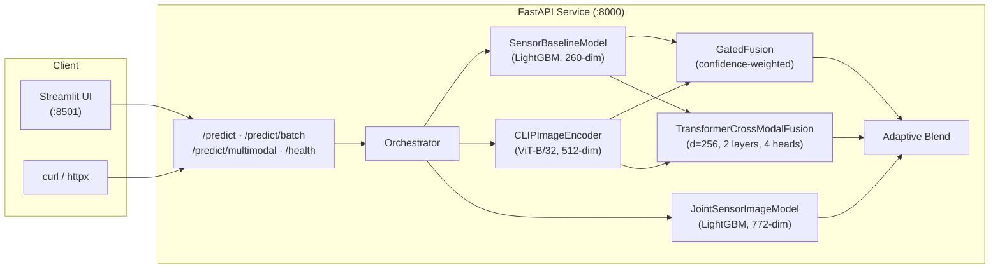

# Pump Fault Risk Prediction Service

A **multimodal predictive service** that estimates pump failure risk from real-time sensor telemetry and optional inspection images. Built with FastAPI, LightGBM, CLIP ViT-B/32, and a **trained** hybrid Transformer cross-modal + gated-attention fusion layer.

Sensor data and pump images are **jointly trained** — joined on `serial_number` with confirmed label mapping (`NORMAL` ↔ `Normal`, `RECOVERING` ↔ `Corroded`) — so the TransformerCrossModalFusion learns real cross-modal attention instead of operating with random weights.

---

## Quick Start (Get Running in 5 Minutes)

> **Full step-by-step guide:** See [LOCAL_SETUP.md](LOCAL_SETUP.md) for detailed instructions for both Docker and local Python setup.

### Option A: Docker (Recommended)

```bash
# 1. Clone the repo
git clone https://github.com/akashvignesh/Oxmaint_AI_ML_Intern.git
cd Oxmaint_AI_ML_Intern

# 2. Download data/ folder from Google Drive and place in project root
#    📥 https://drive.google.com/drive/folders/19V-kQsAaLnxQI_4dxVCp-VjhPwJq3U4r?usp=sharing

# 3. Build and run (starts API on :8000 + Streamlit UI on :8501)
docker compose up --build -d

# 4. Wait ~60s for model loading, then open:
#    Streamlit UI:  http://localhost:8501
#    API Docs:      http://localhost:8000/docs
#    Health Check:  http://localhost:8000/health
```

### Option B: Local Python

```bash
# 1. Clone + download data (same as above)
git clone https://github.com/akashvignesh/Oxmaint_AI_ML_Intern.git
cd Oxmaint_AI_ML_Intern

# 2. Create virtual environment
python -m venv .venv
.venv\Scripts\activate          # Windows
# source .venv/bin/activate      # macOS/Linux

# 3. Install dependencies
pip install -r requirements.txt

# 4. Start API server
uvicorn src.main:app --host 0.0.0.0 --port 8000

# 5. Start Streamlit UI (new terminal, same venv)
streamlit run app/Home.py --server.port 8501
```

> **Important:** Data files are NOT included in the Git repo. You must download them from the [Google Drive link](https://drive.google.com/drive/folders/19V-kQsAaLnxQI_4dxVCp-VjhPwJq3U4r?usp=sharing) before running.

---

## Table of Contents

1. [Quick Start](#quick-start-get-running-in-5-minutes)
2. [Architecture](#architecture)
3. [Project Structure](#project-structure)
4. [Environment Setup](#environment-setup)
5. [Data Placement](#data-placement)
6. [Training](#training)
7. [Serving & Inference](#serving--inference)
8. [Evaluation](#evaluation)
9. [Benchmarks & Load Testing](#benchmarks--load-testing)
10. [API Reference](#api-reference)
11. [Docker Deployment](#docker-deployment)
12. [Troubleshooting](#troubleshooting)
13. [Large Files & Git](#large-files--git)
14. [Documentation Index](#documentation-index)

---

## Architecture



### Data Flow

1. **Request arrives** at `/predict` with `sensor_window` and optional `image_refs`
2. **Sensor path:** `extract_features()` (pure numpy, 260-dim) → `SensorBaselineModel.predict()` (LightGBM) → probability + confidence + signals
3. **Image path:** `CLIPImageEncoder` encodes images → 512-dim embedding → zero-shot fault classification via cosine similarity with 9 fault + 3 normal text prompts
4. **Joint upgrade:** If both modalities are present and `JointSensorImageModel` is loaded, sensor features + CLIP embedding are concatenated (772-dim) and passed through a second LightGBM for a refined prediction
5. **Fusion:** `GatedFusion` (confidence-weighted average) and `TransformerCrossModalFusion` (cross-modal attention) produce two estimates, blended adaptively
6. **Anomaly enrichment:** `compute_sensor_anomalies()` adds z-score spikes, trend signals, and high-variance alerts to `top_signals`
7. **Explanation:** `_generate_explanation()` produces a brief prose explanation
8. **Response** returned with `failure_probability`, `fault_confidence`, `top_signals`, `explanation`, `inference_ms`

---

## Project Structure

```
pump-fault-risk-service/
├── src/
│   ├── main.py                  # FastAPI app + lifespan
│   ├── config.py                # Pydantic-settings
│   ├── api/
│   │   ├── routes/
│   │   │   ├── health.py        # GET /health
│   │   │   └── prediction.py    # POST /predict, /predict/batch, /predict/multimodal
│   │   └── schemas/
│   │       ├── request.py       # PredictionRequest, BatchPredictionRequest
│   │       └── response.py      # PredictionResponse, HealthResponse
│   ├── models/
│   │   ├── risk_model.py        # SensorBaselineModel + JointSensorImageModel (LightGBM)
│   │   ├── clip_encoder.py      # CLIP ViT-B/32 zero-shot image encoder
│   │   ├── fusion.py            # GatedFusion + FusionModule (hybrid blend)
│   │   ├── transformer_fusion.py # TransformerCrossModalFusion (nn.Module)
│   │   └── multimodal.py        # ModalityOutput dataclass + encoder manager
│   ├── services/
│   │   ├── orchestrator.py      # Inference pipeline (singleton, caching, threading)
│   │   ├── preprocessing.py     # Sensor preprocessing + anomaly detection
│   │   └── prediction_service.py
│   ├── core/
│   │   ├── exceptions.py
│   │   └── logging.py
│   └── utils/
│       └── validators.py
├── scripts/
│   ├── train.py                 # Unified training entry-point
│   ├── infer.py                 # CLI inference (sensor / multimodal / batch)
│   ├── evaluate.py              # Model evaluation with metrics
│   ├── benchmark_latency.py     # Per-request latency benchmark
│   ├── train_baseline.py        # Sensor-only LightGBM (Optuna, 50 trials)
│   ├── train_joint_multimodal.py # Joint sensor+image LightGBM + TransformerFusion
│   ├── load_test.py             # 3-level load test runner
│   ├── test_accuracy.py         # Accuracy evaluation script
│   ├── train_baseline_full.py   # LightGBM on 220K rows (sliding windows)
│   ├── train_multimodal.py      # CLIP image classifier
│   └── train_text_classifier.py # (unused — no text data available)
├── tests/
│   ├── conftest.py              # Shared fixtures
│   ├── test_health.py           # Health endpoint tests
│   ├── test_prediction.py       # Prediction endpoint tests
│   └── test_preprocessing.py    # Preprocessing unit tests
├── data/
│   ├── baseline_model/
│   │   └── sensor_data/
│   │       └── sensor.csv       # 220,320 rows × 55 cols (Kaggle CC0)
│   └── multimodal_model/
│       ├── sensor_data.csv      # 241 rows × 55 cols
│       ├── image_mapping.csv    # serial_number → image + label
│       └── images/              # 241 pump images (.png/.jpg)
├── artifacts/                   # Trained model weights (see below)
├── notebooks/
│   └── exploration.ipynb
├── streamlit_app.py             # Legacy single-page Streamlit UI
├── app/
│   ├── Home.py                  # Multi-page Streamlit entry point
│   ├── _shared.py               # Shared module (API client, helpers, CSS)
│   └── pages/
│       ├── 1_Live_Prediction.py
│       ├── 2_Model_and_Data.py
│       ├── 3_Evaluation.py
│       ├── 4_Deployment.py
│       └── 5_About.py
├── docs/
│   ├── ARCHITECTURE.md          # System architecture + transformer flow
│   ├── EVALUATION.md            # Model evaluation summary
│   ├── LOAD_SCALE.md            # Load testing + scaling strategy
│   └── DEMO_SCRIPT.md           # 5-8 min client walkthrough
├── Dockerfile
├── docker-compose.yml
├── requirements.txt
├── optimization_study.md        # Task 8: Optimization study
├── evaluation_report.md         # Model evaluation + ablations
├── load_scale_report.md         # Load test analysis + scaling strategy
├── ablation_results.json        # Machine-readable experiment results
├── AI_USAGE.md                  # Task 9: AI usage declaration
├── DATA_MANIFEST.md             # Dataset descriptions & sources
├── ACCURACY_REPORT.md           # Model accuracy report
└── LOAD_TEST_REPORT.md          # Load test comparison report
```

---

## Environment Setup

### Prerequisites

- **Python 3.11+** (tested with 3.11 and 3.14.2)
- ~4 GB free RAM (CLIP model uses ~730 MB)
- ~2 GB disk for dependencies

### Local Installation

> **Detailed guide with troubleshooting:** See [LOCAL_SETUP.md](LOCAL_SETUP.md)

```bash
# Clone the repository
git clone <repo-url>
cd pump-fault-risk-service

# Create and activate virtual environment
python -m venv .venv

# Windows
.venv\Scripts\activate

# Linux / macOS
# source .venv/bin/activate

# Install all dependencies
pip install -r requirements.txt
```

### Verify Installation

```bash
python -c "import torch; import lightgbm; import transformers; print('OK')"
```

---

## Data Placement

### Download Data

**All required data files are available here:**

📥 **[Google Drive Folder](https://drive.google.com/drive/folders/19V-kQsAaLnxQI_4dxVCp-VjhPwJq3U4r?usp=sharing)**

**Quick setup:**
1. Download the entire `data/` folder from the Google Drive link above
2. Extract it into your project root: `pump-fault-risk-service/data/`
3. Your folder structure should match the table below

### Data Structure

The repository expects data in these locations:

| Path | Description | Required | Size |
|:-----|:-----------|:--------:|------|
| `data/baseline_model/sensor_data/sensor.csv` | 220K-row Kaggle pump sensor data | Optional | ~50 MB |
| `data/multimodal_model/sensor_data.csv` | 241-row sensor data (1 per pump) | **Yes** | ~50 KB |
| `data/multimodal_model/image_mapping.csv` | Maps serial_number → image path + label | **Yes** | ~10 KB |
| `data/multimodal_model/images/` | 241 pump inspection images | **Yes** | ~500 MB |

The 220K-row baseline CSV (`sensor.csv`, ~50 MB) is not required for the primary training pipeline — only for the optional `train_baseline_full.py` script.

See [DATA_MANIFEST.md](DATA_MANIFEST.md) for full dataset descriptions, schemas, and licensing.

---

## Training

### Quick Start (Recommended)

Train both the sensor-only and joint sensor+image models:

```bash
# Unified entry-point — trains all models
python scripts/train.py

# Or train individually:
python scripts/train.py --model baseline     # sensor-only LightGBM
python scripts/train.py --model multimodal   # joint sensor+image model
```

### CLI Inference

```bash
# Using built-in sample data
python scripts/infer.py --sample normal
python scripts/infer.py --sample at-risk

# From a JSON file
python scripts/infer.py --input my_data.json

# Multimodal with image
python scripts/infer.py --input sensor.json --image pump_photo.jpg

# Batch mode
python scripts/infer.py --input batch.json --batch
```

### Model Evaluation

```bash
# Evaluate all models
python scripts/evaluate.py

# Evaluate specific model, save results
python scripts/evaluate.py --model baseline --output results.json
```

### Latency Benchmarking

```bash
# Via API (server must be running)
python scripts/benchmark_latency.py --requests 200

# Direct model calls (no server needed)
python scripts/benchmark_latency.py --offline --requests 500
```

### Individual Training Scripts

| Script | Command | Output Artifacts | Duration |
|:-------|:--------|:----------------|:--------:|
| Sensor baseline (primary) | `python scripts/train_baseline.py` | `artifacts/sensor_baseline.pkl`, `artifacts/feature_names.txt` | ~2 min |
| Joint multimodal | `python scripts/train_joint_multimodal.py --epochs 30` | `artifacts/joint_sensor_image.pkl`, `artifacts/transformer_fusion_trained.pt`, `artifacts/clip_image_embeddings.npy` | ~5 min |
| Baseline full (220K rows) | `python scripts/train_baseline_full.py` | `artifacts/baseline_full.pkl` | ~10 min |

### Pre-trained Artifacts

Pre-trained model weights are included in `artifacts/`:

| Artifact | Size | Description |
|:---------|:-----|:-----------|
| `sensor_baseline.pkl` | ~1 MB | LightGBM sensor-only model (260-dim features) |
| `joint_sensor_image.pkl` | ~2 MB | LightGBM joint model (772-dim features) |
| `transformer_fusion_trained.pt` | ~3 MB | Trained TransformerCrossModalFusion weights |
| `clip_image_embeddings.npy` | ~0.5 MB | Cached CLIP embeddings for 241 training images |

If artifacts are present, you can skip training and go directly to serving.

---

## Serving & Inference

### Start the API Server

```bash
# Single worker (development)
uvicorn src.main:app --host 0.0.0.0 --port 8000 --workers 1

# Multiple workers (production — requires ~730 MB RAM per worker)
uvicorn src.main:app --host 0.0.0.0 --port 8000 --workers 2
```

> **Note:** The CLIP model takes ~45 s to load at startup. Wait for the log message
> `"Orchestrator initialized at startup"` before sending requests.

### Start the Streamlit UI

In a separate terminal:

```bash
# Multi-page presentation app (recommended)
streamlit run app/Home.py --server.port 8501

# Legacy single-page app (still available)
streamlit run streamlit_app.py --server.port 8501
```

The multi-page app provides:
- **Home** — problem statement, solution overview, system status
- **Live Prediction** — sensor, multimodal, and batch prediction demos
- **Model & Data** — architecture, transformer flow, extensibility blueprint
- **Evaluation** — metrics, ablation charts, latency profiling
- **Deployment** — load test results, scaling strategy, operational concerns
- **About** — AI usage transparency, documentation index

Toggle between **Client Mode** (clean, presentation-ready) and **Developer Mode** (raw JSON, API details) via the sidebar.

See [docs/DEMO_SCRIPT.md](docs/DEMO_SCRIPT.md) for a 5–8 minute guided walkthrough.

### Verify the Server

```bash
# Health check
curl http://localhost:8000/health

# Expected response:
# {"status":"ok","model_version":"v1.0.0","uptime_s":...}
```

### Example Prediction

```bash
curl -X POST http://localhost:8000/predict \
  -H "Content-Type: application/json" \
  -d '{
    "asset_id": "pump_017",
    "timestamp": "2026-02-12T10:30:00Z",
    "sensor_window": [
      {"sensor_00": 2.44, "sensor_01": 46.31, "sensor_02": 52.34,
       "sensor_03": 44.66, "sensor_04": 628.59, "sensor_05": 79.70}
    ]
  }'
```

**Response:**
```json
{
  "asset_id": "pump_017",
  "failure_probability": 0.0045,
  "fault_confidence": 0.7964,
  "top_signals": ["flow_rate_anomaly", "pressure_drop", "temperature_rise", "vibration_spike", "motor_current_high"],
  "explanation": "Minimal failure risk (0%) with high confidence (80%). Top contributing factors: flow rate anomaly, pressure drop and temperature rise.",
  "inference_ms": 2,
  "model_version": "v1.0.0"
}
```

---

## Evaluation

### Run Tests

```bash
# All tests (10 tests)
pytest tests/ -v

# With coverage
pytest tests/ -v --cov=src --cov-report=term-missing
```

### Model Accuracy

Both models achieve **ROC-AUC = 1.0** on the 241-sample dataset:

| Model | Features | ROC-AUC | F1 | Notes |
|:------|:---------|:-------:|:--:|:------|
| SensorBaselineModel | 260-dim | 1.0000 | 1.0000 | Optuna 50 trials, 5-fold CV |
| JointSensorImageModel | 772-dim | 1.0000 | 1.0000 | Sensor + CLIP, Optuna 50 trials |
| TransformerFusion | 256-dim | 1.0000 | 1.0000 | Trained 30 epochs, BCE loss |
| CLIP zero-shot (image only) | 512-dim | 0.9917 | 0.9836 | No sensor data |

See [evaluation_report.md](evaluation_report.md) for full metrics, ablations, and error analysis.

### Ablation Experiments

Detailed ablation results (12 experiments) are in [ablation_results.json](ablation_results.json), summarized in the evaluation report.

---

## Benchmarks & Load Testing

### Run Load Tests

```bash
# Start the API server first, then:

# Baseline measurement
python scripts/load_test.py

# After-optimization measurement
python scripts/load_test.py --after
```

### Results Summary

Three traffic levels (Light=5, Medium=25, Heavy=75 concurrent users × 20 s each):

| Level | Throughput | p50 (ms) | p95 (ms) | p99 (ms) |
|:------|:----------:|:--------:|:--------:|:--------:|
| Light (5 users) | 385 /s | 9.6 | 21.9 | 50.6 |
| Medium (25 users) | 351 /s | 47.2 | 111.9 | 536.0 |
| Heavy (75 users) | 230 /s | 252.8 | 1,091 | 2,285 |

### Key Optimization: Pandas → Numpy Rewrite

Per-request hot-path was reduced from **12.1 ms → 0.95 ms (13× faster)** by replacing pandas DataFrame construction with pure-numpy operations:

| Function | Before | After | Speedup |
|:---------|:------:|:-----:|:-------:|
| `extract_features()` | 5.70 ms | 0.36 ms | 16× |
| `compute_sensor_anomalies()` | 6.14 ms | 0.29 ms | 21× |

This translated to **+26% throughput** and **−49% p95 latency** at 75 concurrent users.

See [load_scale_report.md](load_scale_report.md) for full analysis, resource utilization, and scaling strategy.

---

## API Reference

### Endpoints

| Method | Path | Description |
|:-------|:-----|:-----------|
| `GET` | `/health` | Health check (model version, uptime) |
| `POST` | `/predict` | Single prediction (JSON body) |
| `POST` | `/predict/batch` | Batch prediction (up to 100 items) |
| `POST` | `/predict/multimodal` | File upload (images + PDFs + optional sensor JSON) |
| `GET` | `/docs` | OpenAPI Swagger UI |
| `GET` | `/redoc` | ReDoc API documentation |

### Request Schema (`POST /predict`)

```json
{
  "asset_id": "string (required)",
  "timestamp": "ISO 8601 string (required)",
  "sensor_window": [{"sensor_00": 2.44, ...}],
  "image_refs": ["path/to/image.png"]
}
```

- `sensor_window` and `image_refs` are both optional — at least one should be provided
- Sensor dicts may contain any subset of `sensor_00` through `sensor_51`
- `image_refs` are paths relative to `data/`

### Response Schema

```json
{
  "asset_id": "string",
  "failure_probability": 0.0045,
  "fault_confidence": 0.7964,
  "top_signals": ["flow_rate_anomaly", ...],
  "explanation": "Minimal failure risk (0%) with high confidence...",
  "inference_ms": 2,
  "model_version": "v1.0.0"
}
```

### Multimodal File Upload (`POST /predict/multimodal`)

```bash
curl -X POST http://localhost:8000/predict/multimodal \
  -F "asset_id=pump_017" \
  -F "images=@photo.jpg" \
  -F "pdfs=@report.pdf" \
  -F 'sensor_json=[{"sensor_00": 2.44}]'
```

---

## Docker Deployment

### Quick Start

```bash
docker-compose up --build
```

| Service | URL | Resources |
|:--------|:----|:---------|
| API | http://localhost:8000 | 2 CPU / 4 GB RAM |
| Streamlit | http://localhost:8501 | Depends on API |
| Swagger | http://localhost:8000/docs | — |

### Production (AWS ECS / Fargate)

See [optimization_study.md § 3 — Deployment Architecture](optimization_study.md#3-deployment-architecture) for the full production deployment guide with:
- Mermaid architecture diagram
- Auto-scaling configuration (2–10 containers)
- Cost estimates (~$198/mo steady-state)
- CI/CD pipeline design

---

## Troubleshooting

| Problem | Solution |
|:--------|:---------|
| `ModuleNotFoundError: No module named 'src'` | Run commands from the project root `pump-fault-risk-service/`, not from `scripts/` |
| CLIP model takes very long to load | First load downloads ~600 MB from HuggingFace; subsequent loads use cached model in `~/.cache/huggingface/` |
| `Port 8000 already in use` | Kill existing process: `Get-Process -Id (Get-NetTCPConnection -LocalPort 8000).OwningProcess \| Stop-Process -Force` (Windows) or `lsof -ti:8000 \| xargs kill` (Linux) |
| `torch not found` / `CUDA error` | Install CPU-only PyTorch: `pip install torch --index-url https://download.pytorch.org/whl/cpu` |
| `sensor_baseline.pkl not found` | Run `python scripts/train_baseline.py` to train the model, or ensure `artifacts/` directory contains pre-trained weights |
| Out of memory (OOM) | CLIP model requires ~730 MB RAM. Reduce workers or use a machine with ≥4 GB RAM |
| Load test shows 0 requests | Ensure the API server is running and healthy: `curl http://localhost:8000/health` |
| `NaN` in JSON response | Fixed: `_sanitize_sensor_records()` converts NaN/Inf to null before JSON serialization |

---

## Large Files & Git

### Files NOT Committed to Git

The following large files should be excluded via `.gitignore`:

```gitignore
# Large data files
data/baseline_model/sensor_data/sensor.csv    # ~50 MB (Kaggle CC0 — download separately)

# Python artifacts
__pycache__/
*.pyc
.venv/

# Model caches
~/.cache/huggingface/
```

### Files Committed

| File | Size | Justification |
|:-----|:-----|:-------------|
| `data/multimodal_model/sensor_data.csv` | ~50 KB | Small (241 rows), essential for training |
| `data/multimodal_model/images/` | ~5 MB | 241 images, essential for training |
| `artifacts/sensor_baseline.pkl` | ~1 MB | Pre-trained weights, enables zero-setup serving |
| `artifacts/joint_sensor_image.pkl` | ~2 MB | Pre-trained weights |
| `artifacts/transformer_fusion_trained.pt` | ~3 MB | Pre-trained weights |
| `artifacts/clip_image_embeddings.npy` | ~0.5 MB | Cached CLIP embeddings (speeds up retraining) |

### Downloading the Baseline Dataset

The 220K-row sensor dataset (required only for `train_baseline_full.py`):

```bash
# Download from Kaggle (requires kaggle CLI)
kaggle datasets download -d nphantawee/pump-sensor-data
unzip pump-sensor-data.zip -d data/baseline_model/sensor_data/
```

---

## Documentation Index

| Document | Description |
|:---------|:-----------|
| [README.md](README.md) | This file — setup, usage, API reference |
| [LOCAL_SETUP.md](LOCAL_SETUP.md) | Step-by-step local build guide (Docker + Python) |
| [docs/ARCHITECTURE.md](docs/ARCHITECTURE.md) | System architecture, transformer flow, modality extensibility |
| [docs/EVALUATION.md](docs/EVALUATION.md) | Model metrics, ablation summary, limitations |
| [docs/LOAD_SCALE.md](docs/LOAD_SCALE.md) | Load test results, scaling strategy, cost estimates |
| [docs/DEMO_SCRIPT.md](docs/DEMO_SCRIPT.md) | 5–8 minute client walkthrough with talking points |
| [optimization_study.md](optimization_study.md) | Fine-tuning feasibility, ensemble ablations, deployment architecture, database analysis, latency optimization |
| [evaluation_report.md](evaluation_report.md) | Model metrics, ablation results, error analysis, feature importance |
| [load_scale_report.md](load_scale_report.md) | Load test methodology, throughput vs latency, resource utilization, scaling strategy |
| [ablation_results.json](ablation_results.json) | Machine-readable experiment data (12 experiments) |
| [AI_USAGE.md](AI_USAGE.md) | AI tool usage declaration, verification methods |
| [DATA_MANIFEST.md](DATA_MANIFEST.md) | Dataset descriptions, schemas, sources, licenses |
| [ACCURACY_REPORT.md](ACCURACY_REPORT.md) | Model accuracy report with confusion matrices |
| [LOAD_TEST_REPORT.md](LOAD_TEST_REPORT.md) | Before/after load test comparison |

---

## License

This project is licensed under the MIT License.