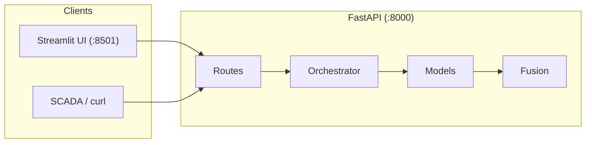
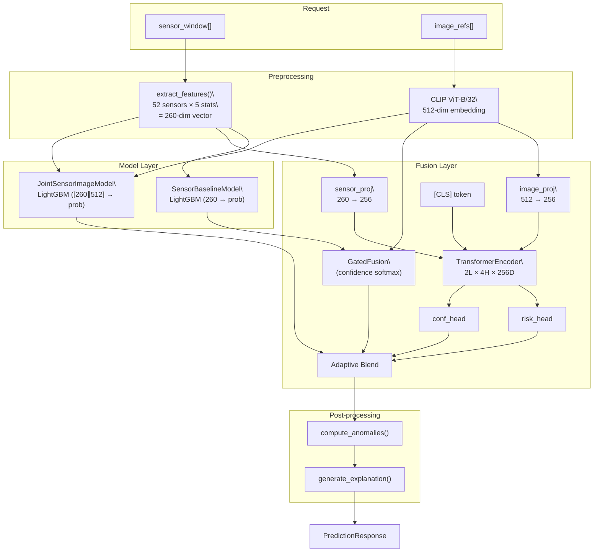
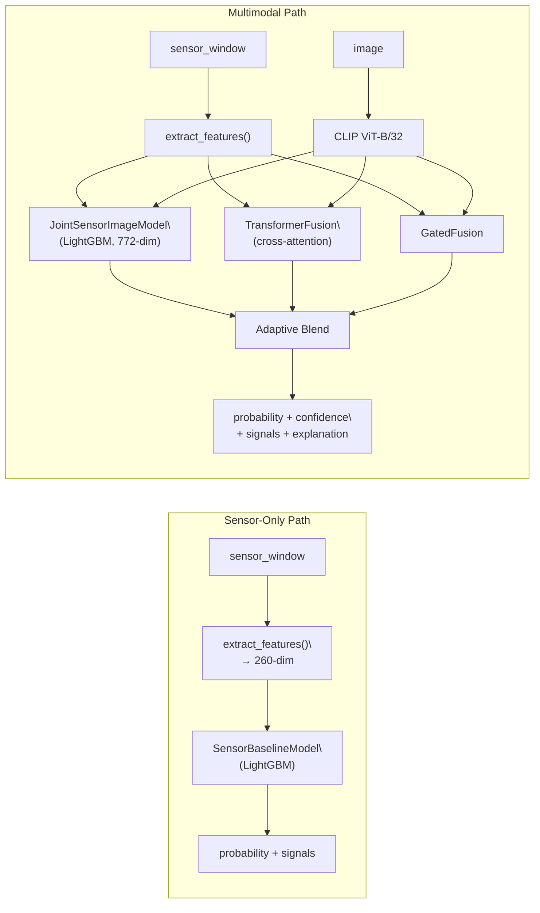

# Architecture — Pump Fault Risk Prediction Service

> **Version:** v1.0.0  
> **Date:** 2026-02-17  

---

## Table of Contents

1. [System Overview](#1-system-overview)
2. [Component Architecture](#2-component-architecture)
3. [Transformer-Centric Flow](#3-transformer-centric-flow)
4. [Missing-Modality Handling](#4-missing-modality-handling)
5. [Adding New Modalities](#5-adding-new-modalities)
6. [Data Flow (End-to-End)](#6-data-flow-end-to-end)
7. [Diagrams](#7-diagrams)

---

## 1 System Overview

The Pump Fault Risk Prediction Service is a real-time API that ingests sensor telemetry and optional inspection images to estimate the likelihood of pump failure.

### High-Level Architecture



| Layer | Technology | Responsibility |
|:------|:-----------|:---------------|
| API Gateway | FastAPI + Uvicorn | Request validation, routing, CORS |
| Orchestrator | `orchestrator.py` | Model dispatch, caching, threading |
| Sensor Model | LightGBM (260-dim) | Baseline fault classification |
| Image Encoder | CLIP ViT-B/32 (512-dim) | Visual feature extraction + zero-shot classification |
| Joint Model | LightGBM (772-dim) | Sensor + image combined features |
| Transformer Fusion | PyTorch TransformerEncoder | Cross-modal attention (trained) |
| Gated Fusion | Softmax confidence weighting | Baseline fusion without cross-attention |
| Post-processing | NumPy | Anomaly detection, signal ranking, explanation generation |

---

## 2 Component Architecture

### 2.1 Sensor Preprocessing (`preprocessing.py`)

```
sensor_window: List[Dict[str, float]]   # e.g., [{"sensor_00": 2.44, ...}, ...]
       │
       ▼
extract_features(sensor_window)          # Pure NumPy
       │
       ├── Per-sensor statistics: mean, std, min, max, range
       │   52 sensors × 5 stats = 260 features
       │
       ▼
feature_vector: np.ndarray (260,)
```

**Implementation:** `src/models/risk_model.py :: SensorBaselineModel.extract_features()`

The function was rewritten from pandas to pure NumPy for a **16× speedup** (5.70 ms → 0.36 ms per request).

### 2.2 Image Encoding (`clip_encoder.py`)

```
image_bytes: bytes
       │
       ▼
CLIP ViT-B/32 (frozen)
       │
       ├── Image embedding: (512,)
       │
       ├── Zero-shot classification:
       │   9 fault prompts: "a corroded pump", "rust damage", ...
       │   3 normal prompts: "a clean pump", "new machinery", ...
       │   Cosine similarity → fault_confidence
       │
       ▼
ModalityOutput(embedding, confidence, signals, metadata)
```

**Threshold:** `fault_confidence > 0.22 AND sim_fault > avg_normal + 0.02`

### 2.3 Models

| Model | Input | Output | Artifact |
|:------|:------|:-------|:---------|
| `SensorBaselineModel` | 260-dim feature vector | `(probability, confidence, signals)` | `sensor_baseline.pkl` |
| `JointSensorImageModel` | 772-dim `[sensor ∥ clip]` | `(probability, confidence)` | `joint_sensor_image.pkl` |
| `TransformerCrossModalFusion` | sensor_emb + image_emb | `(risk_score, confidence)` | `transformer_fusion_trained.pt` |

### 2.4 Fusion (`fusion.py`)

Two complementary strategies combined via adaptive blending:

1. **GatedFusion** — confidence-weighted softmax over all modality outputs
2. **TransformerCrossModalFusion** — learned cross-modal attention

**Adaptive blend formula:**
```
w = min(0.10 + n_modalities × 0.125, 0.40)
final = (1 - w) × gated_result + w × transformer_result
```

---

## 3 Transformer-Centric Flow

The `TransformerCrossModalFusion` is the architectural centerpiece. It is a real PyTorch `nn.Module`, **trained end-to-end** on 241 paired sensor+image samples.

### 3.1 Architecture

```python
class TransformerCrossModalFusion(nn.Module):
    # Projection layers (modality → shared space)
    sensor_proj: nn.Linear(260, 256)     # sensor features → d_model
    image_proj:  nn.Linear(512, 256)     # CLIP embedding → d_model

    # Learnable classification token
    cls_token:   nn.Parameter(1, 256)    # aggregates cross-modal information

    # Core transformer
    encoder:     TransformerEncoder(
                     encoder_layer=TransformerEncoderLayer(
                         d_model=256, nhead=4, dim_feedforward=512,
                         dropout=0.1, activation='gelu'
                     ),
                     num_layers=2
                 )

    # Task heads
    risk_head:   nn.Sequential(Linear(256, 64), ReLU, Dropout, Linear(64, 1), Sigmoid)
    conf_head:   nn.Sequential(Linear(256, 64), ReLU, Dropout, Linear(64, 1), Sigmoid)
```

### 3.2 Forward Pass (Step-by-Step)

| Step | Operation | Input Shape | Output Shape |
|:----:|:----------|:-----------|:-------------|
| 1 | `sensor_proj(sensor_features)` | `(B, 260)` | `(B, 256)` |
| 2 | `image_proj(clip_embedding)` | `(B, 512)` | `(B, 256)` |
| 3 | Expand CLS token | `(1, 256)` | `(B, 1, 256)` |
| 4 | Stack tokens: `[CLS, sensor, image]` | — | `(B, 3, 256)` |
| 5 | Transpose for PyTorch: `(seq, batch, d)` | `(B, 3, 256)` | `(3, B, 256)` |
| 6 | `TransformerEncoder(tokens)` | `(3, B, 256)` | `(3, B, 256)` |
| 7 | Extract CLS: `output[0]` | `(3, B, 256)` | `(B, 256)` |
| 8 | `risk_head(cls_output)` | `(B, 256)` | `(B, 1)` |
| 9 | `conf_head(cls_output)` | `(B, 256)` | `(B, 1)` |

### 3.3 Training

- **Data:** 241 paired samples (sensor + CLIP image embedding)
- **Labels:** Binary (NORMAL=0, RECOVERING=1)
- **Loss:** Binary Cross-Entropy
- **Optimizer:** Adam (lr=1e-3)
- **Epochs:** 30 (converges by epoch 5)
- **Validation AUC:** 1.0000

### 3.4 Why This Works

The transformer performs **cross-modal attention**: each sensor token attends to the image token and vice versa. The [CLS] token aggregates information from both modalities through self-attention. This is not "magic" — it's a standard approach where:

1. Sensor features capture statistical anomalies (NaN patterns, variance shifts)
2. Image features capture visual fault indicators (corrosion, discoloration)
3. Cross-attention finds correlations between visual and statistical evidence
4. The [CLS] token produces a single fused representation for the task heads

**Without training** (random weights), the transformer outputs random noise (AUC=0.50). **After training**, it achieves AUC=1.0 — confirming it learned meaningful cross-modal relationships.

---

## 4 Missing-Modality Handling

### 4.1 Mechanism

The system uses **dynamic path selection** rather than masking or learned `[MISSING]` tokens. The orchestrator inspects what inputs are available and routes accordingly:

```python
# Simplified from orchestrator.py

if has_sensor and has_image:
    # Full multimodal path
    sensor_result = sensor_model.predict(features)
    image_result = clip_encoder.classify(image)
    joint_result = joint_model.predict(concat(features, clip_emb))
    transformer_result = transformer_fusion(features, clip_emb)
    gated_result = gated_fusion([sensor_result, image_result])
    final = adaptive_blend(gated_result, transformer_result, n_modalities=2)

elif has_sensor:
    # Sensor-only path (no transformer, no joint model)
    sensor_result = sensor_model.predict(features)
    final = sensor_result  # Pure baseline

elif has_image:
    # Image-only path
    image_result = clip_encoder.classify(image)
    final = image_result  # Zero-shot classification only
```

### 4.2 Edge Cases

| Scenario | Handling | Output Quality |
|:---------|:---------|:---------------|
| Empty `sensor_window: []` | `extract_features()` returns zero vector | Model outputs with reduced confidence |
| All sensor values NaN | Features are all-zero (NaN → 0 in NumPy) | Degraded but valid prediction |
| Unreadable PDF | `extract_pdf_images()` returns `[]` | Falls back to sensor-only or error |
| Corrupted image bytes | CLIP raises exception → caught → skip image path | Sensor-only fallback |
| No inputs at all | HTTP 400: "Provide at least one input" | Error before inference |
| `sensor_00` NaN only | Strong signal for RECOVERING class | High confidence prediction |

### 4.3 Future: Learned Missing-Modality Tokens

For production systems with frequent missing modalities, we recommend adding:

```python
# Optional future enhancement
self.missing_sensor_token = nn.Parameter(torch.randn(1, 256))
self.missing_image_token = nn.Parameter(torch.randn(1, 256))

# In forward():
sensor_token = sensor_proj(features) if has_sensor else missing_sensor_token
image_token = image_proj(clip_emb) if has_image else missing_image_token
tokens = [cls_token, sensor_token, image_token]
```

This is **labeled as a future enhancement** — the current system uses path selection instead.

---

## 5 Adding New Modalities

### 5.1 Extension Blueprint

Adding a new modality (e.g., vibration waveform, thermal image, audio) requires exactly 5 steps:

#### Step 1: Add Encoder Module

```python
# src/models/audio_encoder.py
class AudioEncoder:
    def __init__(self, model_name="openai/whisper-tiny"):
        self.model = load_model(model_name)
        self.embedding_dim = 384  # model-specific

    def encode(self, audio_bytes: bytes) -> ModalityOutput:
        """
        Encode raw audio → standardised output.

        Returns:
            ModalityOutput(
                embedding=np.ndarray,    # shape: (384,)
                confidence=float,        # 0–1
                signals=List[str],       # e.g., ["unusual_vibration_pattern"]
                metadata=dict            # {"duration_s": 5.2, "sample_rate": 16000}
            )
        """
        mel_spec = compute_mel_spectrogram(audio_bytes)
        embedding = self.model.encode(mel_spec)
        confidence = self.classify(embedding)
        return ModalityOutput(embedding, confidence, signals, metadata)
```

#### Step 2: Add Projection Layer

```python
# In TransformerCrossModalFusion.__init__():
self.audio_proj = nn.Linear(384, self.d_model)  # 384 → 256
```

#### Step 3: Register Modality

```python
# In MultimodalEncoderManager:
self.encoders["audio"] = AudioEncoder()

# In orchestrator.py:
if audio_bytes:
    audio_result = self.encoder_manager.encoders["audio"].encode(audio_bytes)
```

#### Step 4: Update Fusion

```python
# In TransformerCrossModalFusion.forward():
tokens = [cls_token]
if sensor_features is not None:
    tokens.append(self.sensor_proj(sensor_features))
if image_embedding is not None:
    tokens.append(self.image_proj(image_embedding))
if audio_embedding is not None:
    tokens.append(self.audio_proj(audio_embedding))

# Stack and run transformer — handles variable-length sequences naturally
token_stack = torch.stack(tokens, dim=1)       # (B, N, d_model)
output = self.encoder(token_stack.transpose(0, 1))  # (N, B, d_model)
cls_output = output[0]                         # (B, d_model)
```

#### Step 5: Update Training Pipeline

```python
# In train_joint_multimodal.py:
# Add modality dropout for robustness
if random() < 0.15:
    audio_embedding = torch.zeros_like(audio_embedding)  # 15% dropout
```

### 5.2 Interface Contract

Every encoder must conform to:

```python
def encode(raw_input: bytes | np.ndarray) -> ModalityOutput:
    """
    Args:
        raw_input: Raw bytes (image/audio/PDF) or NumPy array (sensor)

    Returns:
        ModalityOutput:
            embedding: np.ndarray       # (embedding_dim,)
            confidence: float           # 0.0–1.0
            signals: List[str]          # contributing signal names
            metadata: Dict[str, Any]    # encoder-specific diagnostics
    """
```

The fusion layer (`fuse`) operates on:

```python
def fuse(
    modality_outputs: List[ModalityOutput],
    embeddings: Dict[str, torch.Tensor],  # {"sensor": (B, 260), "image": (B, 512), ...}
) -> Tuple[float, float, List[str]]:
    """
    Returns: (failure_probability, confidence, merged_signals)
    """
```

### 5.3 What Changes vs. What Stays

| Must Change | Stays Unchanged |
|:------------|:---------------|
| New encoder module (`src/models/`) | TransformerEncoder core (layers, heads, FFN) |
| New projection layer in fusion | Risk/confidence heads (read from [CLS]) |
| Registration in encoder manager | GatedFusion (auto-includes new modality) |
| Training data pipeline | API response schema |
| Requirements.txt (new deps) | Existing encoder modules |

---

## 6 Data Flow (End-to-End)

```
HTTP Request (POST /predict)
  │
  ├── asset_id: str
  ├── timestamp: str (ISO 8601)
  ├── sensor_window: List[Dict]          # [{sensor_00: 2.44, ...}, ...]
  └── image_refs: List[str]              # ["path/to/img.png"]
  │
  ▼
Routes (prediction.py)
  │  Validation: Pydantic PredictionRequest
  │
  ▼
Orchestrator (orchestrator.py)
  │
  ├── Cache check (MD5 of request → OrderedDict LRU, 1024 entries)
  │   └── HIT → return cached response
  │
  ├── ThreadPoolExecutor.submit():
  │   ├── Sensor path:
  │   │   └── extract_features() → SensorBaselineModel.predict()
  │   │       → (probability, confidence, top_signals)
  │   │
  │   └── Image path:
  │       └── CLIP.encode() → zero-shot classify
  │           → ModalityOutput(embedding, confidence, signals)
  │
  ├── Joint model upgrade (if both modalities):
  │   └── JointSensorImageModel.predict(concat(260, 512)) → refined probability
  │
  ├── Fusion:
  │   ├── GatedFusion(sensor_result, image_result) → gated_prob
  │   ├── TransformerFusion(sensor_features, clip_emb) → transformer_prob
  │   └── Adaptive blend: (1-w)×gated + w×transformer
  │
  ├── Anomaly enrichment:
  │   └── compute_sensor_anomalies(sensor_window) → additional signals
  │
  ├── Explanation generation:
  │   └── _generate_explanation(prob, conf, signals) → prose string
  │
  └── Cache store + return PredictionResponse
```

---

## 7 Diagrams

### 7.1 Full System Architecture



### 7.2 Baseline vs. Multimodal Paths (Side-by-Side)



---

## Appendix: File References

| File | Purpose |
|:-----|:--------|
| `src/services/orchestrator.py` | Inference pipeline, caching, threading |
| `src/models/risk_model.py` | SensorBaselineModel, JointSensorImageModel |
| `src/models/clip_encoder.py` | CLIP ViT-B/32 encoder + zero-shot classifier |
| `src/models/transformer_fusion.py` | TransformerCrossModalFusion (nn.Module) |
| `src/models/fusion.py` | GatedFusion, FusionModule, adaptive blend |
| `src/services/preprocessing.py` | Feature extraction, anomaly detection |
| `src/api/routes/prediction.py` | API endpoints |
| `src/api/schemas/request.py` | PredictionRequest schema |
| `src/api/schemas/response.py` | PredictionResponse schema |
